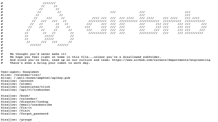
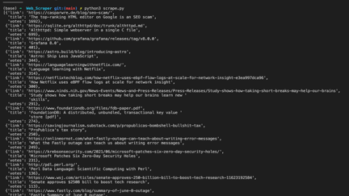

# The Python web scraper

## Problem I want to solve: to collect information from hackernews that has at least 100 points, so I am can read the most relevant info on the topic.

> In simple term web scraping is the art of automate the process of getting data from a website without using their API.
> Why we would do that then?
> There's no API, the API is not free, restricted to certain users or the API is not good enough.

Since we want to build an ethical web scraper, we need to check the example.com/robots.txt file that check who is the 'User-Agent' and what we can scrape 'allow' or not 'Disallow'. If nothing is there, it implicitly means that we should be good to go.

Ex. from Airbnb website:



### Starting the project

We are using **_Beautiful Soup_** ( from PyPI ),as a Python library to scrape websites and **_requests_** to grab _html_ files.

On Terminal:

```terminal
> pip3 install beautifulsoup4
> pip3 install requests
```

We create the Python file: Scrape.py file, importing those libraries.

```python
import requests
from bs4 import BeautifulSoup
import pprint
```

#### How to get the html content of a page from the website?

We can send a request via the module:

```python
res = request.get('https://news.ycombinator.com/news')
# print(res,res.text) # and we are getting back the response status [200] and the html text;
soup = BeautifulSoup(res.text,'html.parser') # transform the raw html string to usable data, a 'soup' object easy to use
links = soup.select('.storylink')
subtext = soup.select('.subtext')
```

Before diving deep into the code, let's see what is Beautiful Soup.

Beautiful Soup is a library that can help us to parse the text via a soup object, but we ned to add one more parameters, specific to get only html and not xml (that Beautiful Soup can parse too)
Beautiful Soup has methods to get all specific data from the html:
Some examples:

```python
# find all contest in a list form
print(soup.body.contents)
# find all paragraphs
print(soup.find_all('p'))
# find all title
print(soup.title)
```

Beautiful Soup **_selectors_**: select(), via using [css selectors](https://developer.mozilla.org/en-US/docs/Learn/CSS/Building_blocks/Selectors)

Now, we are ready to implement a create_custom_hn() function:

```python
# Helper function; this is a common pattern to how to sort dictionaries 'Dict' , using a lambda function where the 2nd parameter is the key we want use to sort

def sort_stories_by_votes(hnlist):
    return sorted(hnlist,key= lambda k: k['votes'],reverse=True)

# Build a the function that create the dict out of collected links and subtext
def create_custom_hn(links,subtext):
    hn = []
    for index,item in enumerate(links):
        # why we use enumerate? we have 2 lists: links and subtext and we enumerate only on links, so the only way to grab subtext is use enumerate and use the index for the subtext
        title = links[index].getText() # we can even use 'item' for 'links[index]' since we don't need the index
        href = links[index].get('href',None)
        vote = subtext[index].select('.score')
        # now we need to check if the vote list exist otherwise we can skip the news
        if len(vote):
            points = int(vote[0].getText().replace(' points','')) # get rid of the 'points' text and just keep the 'integer' for the next check
            # print(points)
            if points > 99:
                hn.append({'title':title,'link':href,'votes':points}) # creating the dictionary
    # return hn
    return sort_stories_by_votes(hn) # Helper function to sort

pprint.pprint(create_custom_hn(links,subtext))
```

Lastly, we just need to run the Python file in the terminal and we are getting a nice, formatted result, thank the the 'pretty-print' module.


